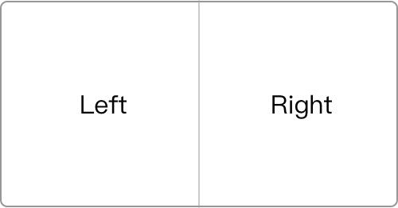
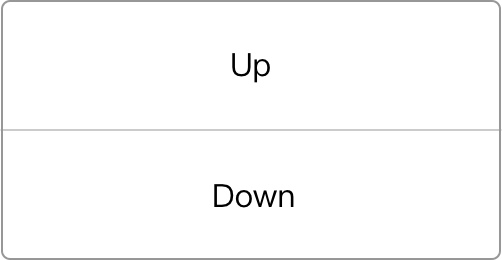
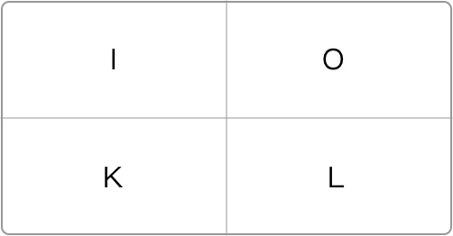
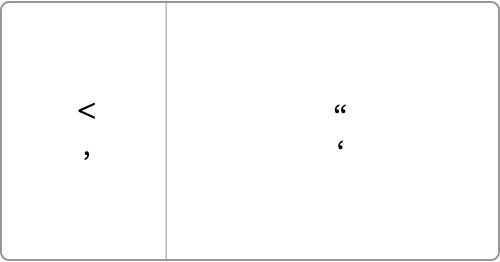
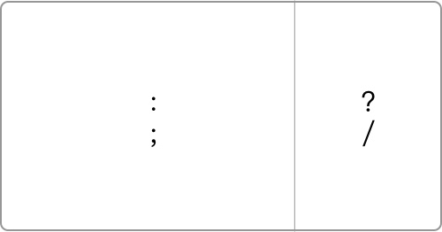

# hammer
A Hammerspoon tools

## 使用

下载并安装 Hammerspoon 👉 [链接](https://github.com/Hammerspoon/hammerspoon/releases/latest)

```shell
git clone https://github.com/hongxuWei/hammer.git
cp hammer/*.lua ~/.hammerspoon
```

## 分屏

### 切换全屏
`⌘ Cmd + ⇧ Shift + F`

### 半屏
- 左半屏 `⌘ Cmd + ⇧ Shift + Left`
- 右半屏 `⌘ Cmd + ⇧ Shift + Right`



- 上半屏 `⌘ Cmd + ⇧ Shift + Up`
- 下半屏 `⌘ Cmd + ⇧ Shift + Down`



### 4 分屏
- 左上 `⌘ Cmd + ⇧ Shift + I`
- 右上 `⌘ Cmd + ⇧ Shift + O`
- 左下 `⌘ Cmd + ⇧ Shift + K`
- 右下 `⌘ Cmd + ⇧ Shift + L`



### 3 分屏
- 左 1/3 `⌘ Cmd + ⇧ Shift + ,`
- 右 2/3 `⌘ Cmd + ⇧ Shift + /`




- 左 2/3 `⌘ Cmd + ⇧ Shift + :`
- 右 1/3 `⌘ Cmd + ⇧ Shift + /`



- 中间 1/3 `⌘ Cmd + ⇧ Shift + .`


